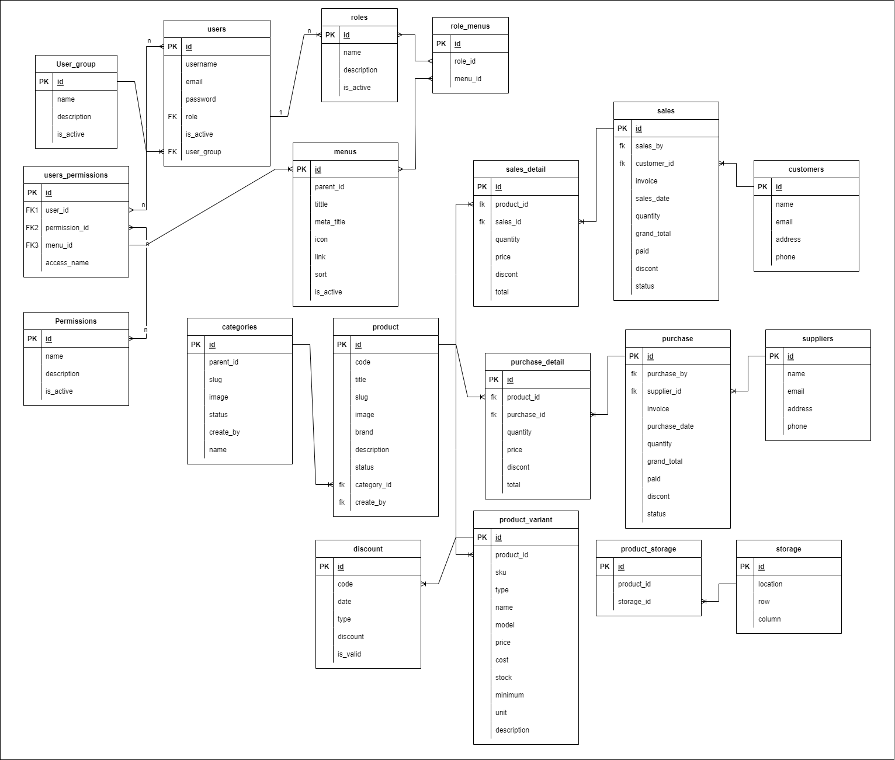

## Simple API dengan AdonisJS v5

Projek ini adalah simple API menggunakan framework AdonisJS dengan TypeScript,
digunakan untuk pembelajaran membuat sebuah API dan response multi bahasa [id, en], yang dapat di gunakan oleh semua jenis Frontend librery atau framework.
Fitur yang ada pada API ini meliputi :

[x] Autentikasi
 
	- Register
	- Login
	- Refresh Token
	- Logout
[] Otorisasi
[x] Role Base Access Permission 
[x] Menu Access
[x] Customer
[x] Supplier
[x] Category
[x] Product

### Teknologi yang digunakan 
- NodeJs
- Framework AdonisJS
- TypeScript
- MySql
- JWT Token
- Bouncer

### Schema Database

	

### Setup
Clone repository ini untuk mengunduh dan menjalankan dengan perintah.

`git clone https://github.com/elSyarif/sibak.git && cd sibak`

Intall packege
 
`npm install` atau `yarn install`

Jalankan migrasi database
 
`npm run migrate`

Menjalankan dengan mode dev
 
`npm run dev` atau `yarn dev`

Untuk menjalankan mode prod
 
`npm run build` atau `yarn build`

 ### Catatan
Simple API ini jauh dari sempurna, jika ada masukan atau diskusi bisa kontak langsung.
 
terimakasih.
 
_best regards_
